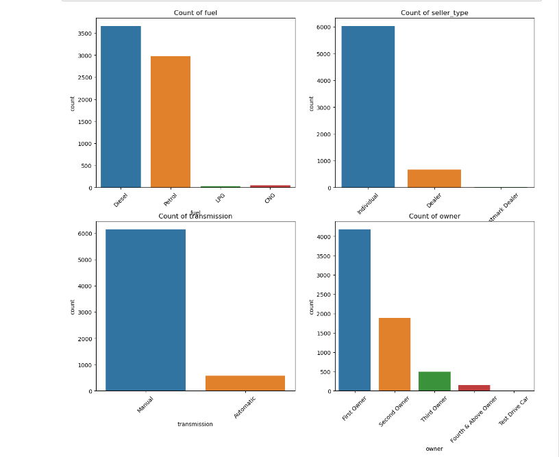

# Car Price Predictor
## Overview
The Car Price predictor is a machine learning tool designed to assist in predicting the prices of cars based on some features. 

## Usage
To start the app, simply run the following command:

#### streamlit run car_predict.py 
This will launch the app in your default browser. You can then input the figures, and click the button to view the price. 

# Exploratory Data Analysis / Prediction

